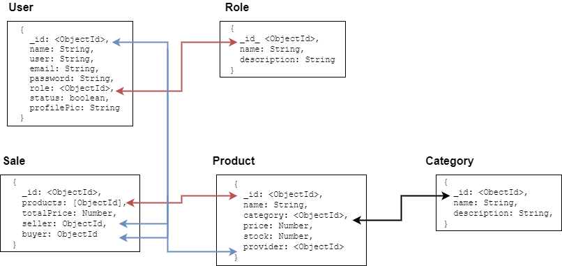

# myShop
Ejercicio práctico para la creación de una tienda online.

## Requerimientos
Se requiere construir una tienda en línea la cual posea la siguiente estructura:
* Registro de usuarios
* Cada usuario puede tener el rol entre (empleado, admin, cliente, proveedor)
* Se debe registrar productos
* Se debe registrar categoría de productos
* Se debe registrar ventas
* Cada proceso debe tener su respectivo CRUD en backend

## Estructura de la base de datos planteada

